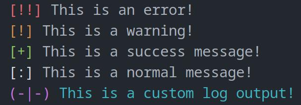

# Present Log
The **easy way** to make your console logs looks good.



## About
Present Log is a really simple **Node.js library** for making pretty console logs.

The entire source is written with **>100 lines** of code, and is overall really minimal.

This is my **first attempt** at making a Node.js library, so if you have any issues make sure to report them [here](https://github.com/mattishere/nvim/issues). Expect at least a moderate amount of bugs!

You're also more than welcome to **send a PR** if you've made something cool or have fixed any bugs, but note that I will likely *not be* checking this repo as often since this was a **very** small test project to make my life a bit easier.

## Installation & Usage

Since this library is not published to NPM, the process of installing it is a bit different, but isn't too difficult nor time consuming.

- Begin by cloning the repository.`git clone https://github.com/mattishere/Present-Log.git`
- Then, go into the directory and run `npm run install && npm run build`. This will install the dependencies and build the library.
- Now, run `npm pack`. This command makes a **.tgz** file.
- Then, in your project, reference the **.tgz** file in your **package.json**:
```JSON
  ...
  "dependencies": {
    "present-log": "file:/path/to/the/file.tgz",
    ...
  },
  ...
```
- And then you're good! Now, it's time to start using the library.

First, begin by importing the main components of the library.

```JavaScript
.js
---

const { output, LogType, Colors } = require("present-log");
```

Now, let's talk about the `output()` function. The function takes 1 parameter, which is of type `LogOptions`. Referencing the source, the type looks like this:
```TypeScript
.ts
---

type LogOptions = {
	type: LogType,
	content: {
		color?: Colors,
		text: string
	},
	prefix?: {
		color?: Colors,
		text: string
	},
}
```
To make our own options for our log, let's begin by defining a very basic error log.
```JavaScript
.js
---

let options = {
    type: LogType.Error,
    content: {
        text: "You have an error!"
    }
}
```
As we can see, we've defined two things: a type property and a content property with a text property. The type property takes the type of enum `LogType`. The enum consists of `Error`, `Warning`, `Success`, `Message`, and `Custom`. All of the enum elements apart from `Custom` require only the `text` property of `content` to function. All of the other properties are ignored (unless you're using `Custom`).

That's pretty much it! You can make some pretty great stuff with this already, but you can take this one step further with custom logs.

Here's an example:
```JavaScript
.js
---

let options = {
    type: LogType.Custom,
    content: {
        text: "This is a custom log, and that's quite cool!",
        color: Colors.Green
    },
    prefix: {
        text: "[/]",
        color: Colors.Cyan
    }
}
```
Here we also make use of the `color` and `prefix` parameters. Both of these are optional, but here's some stuff to note:
- The `Colors` enum consists of simple strings with escape color codes.
- If you initialize the `prefix` property, you have to add the `text` parameter to it.

Great! The last thing to do is make our log in the console. That's pretty simple too. All we have to do is use the `output` method.
```JavaScript
.js
---

...
output(options);
```

That's it! To sumarize, here's the final code we wrote:
```JavaScript
.js
---
const { output, LogType, Colors } = require("present-log");

let options = {
    type: LogType.Custom,
    content: {
        text: "This is a custom log, and that's quite cool!",
        color: Colors.Green
    },
    prefix: {
        text: "[/]",
        color: Colors.Cyan
    }
}

output(options);
```
We should receive an output that looks like this:


## Ending
This is the end! Thank you for checking my little library out, and I hope it comes in handy in one of your projects :).